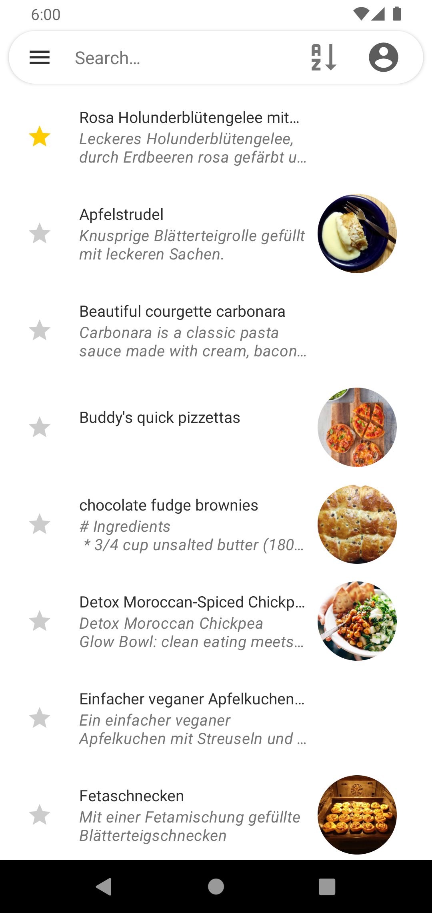
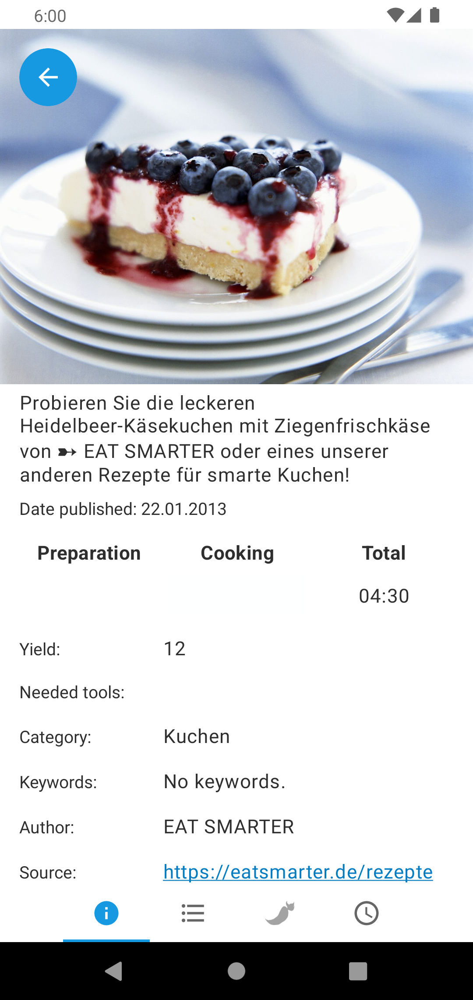
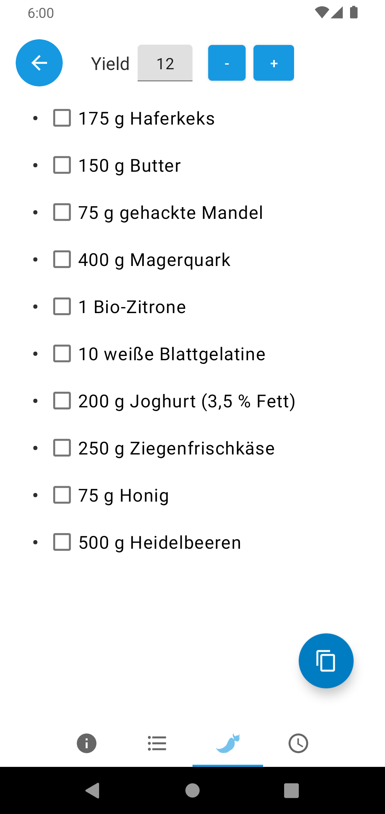

# Nextcloud-Cookbook

## About

This app is a viewer for recipes in Nextcloud App.
You need the Nextcloud Android client to sync the recipes.

**First steps**

First view after installation is a login screen with two ways to use the app.  
With the login button you can choose a nextcloud account from nextcloud client and 
sync directly with the nextcloud server.

If you want to use the local storage you choose "Skip for local storage" and go into settings to choose
the recipe directory for syncing.  
(E.g. the folder for the nextcloud client is _Android/media/com.nextcloud.client/nextcloud/&lt;your account&gt;/&lt;
folder&gt;_).

You also can choose the theme in the settings.

After that, the start view has a list of recipes and you select a recipe to view the details.

You can download new recipes from a supported url or have a cooking timer with click on the cook time.

## Screenshots

## Funding

 |

## Roadmap

- Create new recipes
- Edit recipes
- ...

## Translations

The project can be translated [here](https://translate.codeberg.org/projects/nextcloud-cookbook-android-app/).

Thanks to translators:

- [@mondstern](https://mastodon.technology/@mondstern)
- HudobniVolk
- Balázs Meskó
- Pavel Borecki
- J. Lavoie
- Quang Trung
- Nikita Epifanov

## Contributors

Here I want to thank for contributions to the app.  
Thanks to

- [newhinton](https://codeberg.org/newhinton)
- [mrremo](https://codeberg.org/mrremo)
- [leafar](https://codeberg.org/leafar)

I also want to extend my thanks to  
[Stefan Niedermann](https://github.com/stefan-niedermann) whose apps are a huge inspiration
[Deck](https://github.com/stefan-niedermann/nextcloud-deck) | [Notes](https://github.com/nextcloud/notes-android)

## Dependencies

This app needs Android &gt;= 6.0 (API &gt;= 23) and uses the libraries (see also app/build.gradle):

- androidx dependencies
- kotlinx coroutines
- kotlinx-serialization-json (json parser)
- [kpermissions by fondesa](https://github.com/fondesa/kpermissions) (permission handling)
- [SimpleStorage by anggrayudi](https://github.com/anggrayudi/SimpleStorage) (storage handling and choosing a directory)
- [Android-SingleSignOn by Nextcloud](https://github.com/nextcloud/Android-SingleSignOn) (single sign on with
  nextcloud client)

## License

**Copyright 2020-2024 by MicMun**

This program is free software: you can redistribute it and/or modify it under the terms of the GNU
General Public License as published by the Free Software Foundation, either version 3 of the License, or
(at your option) any later version.
This program is distributed in the hope that it will be useful, but WITHOUT ANY WARRANTY;
without even the implied warranty of MERCHANTABILITY or FITNESS FOR A PARTICULAR PURPOSE.
See the GNU General Public License for more details.
You should have received a copy of the GNU General Public License along with this program. If not, see
[http://www.gnu.org/licenses/](http://www.gnu.org/licenses/).
